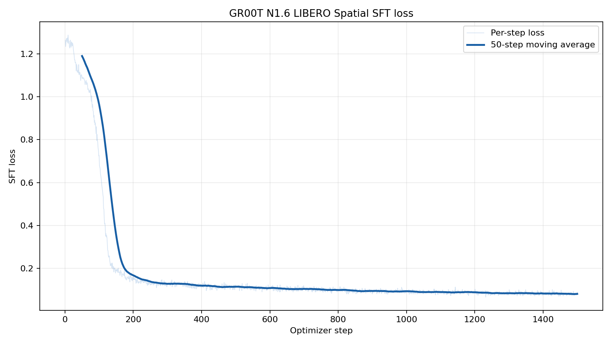
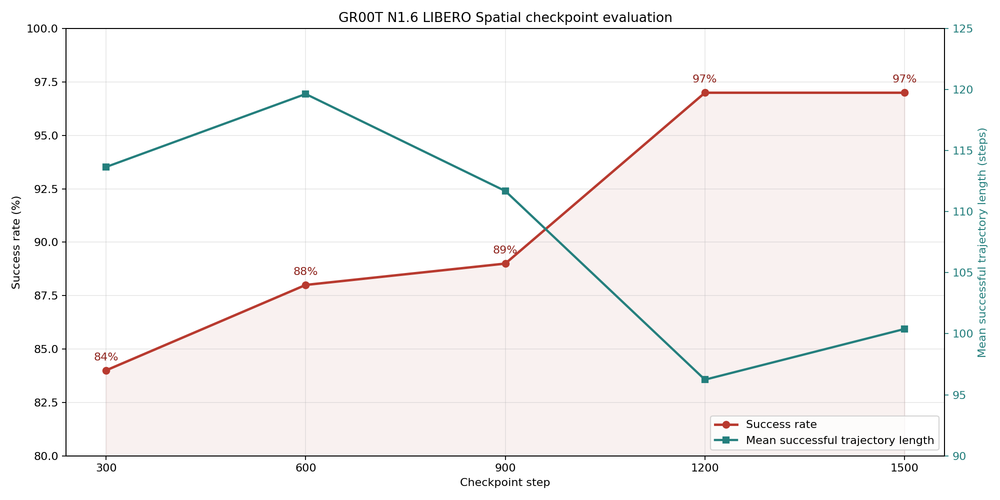

# Fine-tune GR00T N1.6 on LIBERO Spatial

This guide shows how to fine-tune `nvidia/GR00T-N1.6-3B` on the
`lerobot/libero_spatial_image` dataset using supervised fine-tuning (SFT). The
verified Docker environment includes the pinned upstream GR00T source, LIBERO,
MuJoCo, FlashAttention, and the headless rendering dependencies. The recipe is
configured for a single node with eight NVIDIA GPUs.

## Build the environment

From the repository root, build the GR00T image:

```bash
docker build --network=host \
  --file docker/Dockerfile.gr00t \
  --tag verl-vla-gr00t:n1.6 \
  .
```

The build verifies the pinned GR00T N1.6 source and its Eagle assets with
`scripts/install_checks/check_gr00t_n1d6.py`. LIBERO simulation assets are also
downloaded and verified while building the image.

## Prepare the model and dataset

Create the local data directories and download the verified inputs:

```bash
mkdir -p \
  .data/gr00t_sft/models/gr00t_n1d6_3b \
  .data/gr00t_sft/datasets/libero_spatial_image

docker run --rm --network host \
  --volume "$PWD/.data/gr00t_sft:/data" \
  verl-vla-gr00t:n1.6 \
  hf download nvidia/GR00T-N1.6-3B \
    --revision d0814e7ecb19202e7c8468b46098b0b7ef3a6d61 \
    --local-dir /data/models/gr00t_n1d6_3b

docker run --rm --network host \
  --volume "$PWD/.data/gr00t_sft:/data" \
  verl-vla-gr00t:n1.6 \
  hf download lerobot/libero_spatial_image \
    --repo-type dataset \
    --revision d86c0b94922572b3b657e1d1a3d01f0952ddeb46 \
    --local-dir /data/datasets/libero_spatial_image
```

The model repository is gated. Accept its terms on Hugging Face and pass
`--env HF_TOKEN` to the relevant `docker run` command when authentication is
required.

GR00T also requires normalization statistics for the training data. Compute
them once with:

```bash
docker run --rm --network host --shm-size 64g \
  --volume "$PWD:/workspace/verl-vla" \
  --workdir /workspace/verl-vla \
  verl-vla-gr00t:n1.6 \
  python scripts/compute_norm_stats.py \
    --repo-id lerobot/libero_spatial_image \
    --root .data/gr00t_sft/datasets/libero_spatial_image \
    --output-path .data/gr00t_sft/datasets/libero_spatial_image/norm_stats.json \
    --batch-size 32 \
    --num-workers 8
```

The resulting input layout is:

```text
.data/gr00t_sft/
├── datasets/
│   └── libero_spatial_image/
│       ├── data/
│       ├── meta/
│       ├── videos/
│       └── norm_stats.json
└── models/
    └── gr00t_n1d6_3b/
```

Downloaded inputs stay under `.data/gr00t_sft` and are reused by later runs.

## Start training

Launch a container with the repository mounted, then run the minimal training
launcher:

```bash
docker run --rm --interactive --tty \
  --name gr00t-sft \
  --gpus all \
  --network host \
  --ipc host \
  --ulimit memlock=-1 \
  --ulimit stack=67108864 \
  --volume "$PWD:/workspace/verl-vla" \
  --workdir /workspace/verl-vla \
  verl-vla-gr00t:n1.6 \
  bash examples/fine_tuning/gr00t/libero_spatial/run_train.sh
```

The launcher checks the GR00T installation and then starts the shared SFT
workflow. The repository mount keeps the example, configuration, and Python
source live, so source-only changes do not require rebuilding the image.

Training artifacts are written under
`outputs/train/gr00t-sft/libero-spatial`. Append Hydra overrides to the command
when a run setting needs to change. For example, to train for 1,500 steps:

```bash
bash examples/fine_tuning/gr00t/libero_spatial/run_train.sh \
  cluster.actor_rollout_ref.actor.optim.total_training_steps=1500
```

## Default configuration

| Setting | Value |
| --- | --- |
| Model | `nvidia/GR00T-N1.6-3B` |
| Dataset | `lerobot/libero_spatial_image` |
| Nodes | 1 |
| GPUs | 8 |
| Global batch size | 256 |
| Micro-batch size | 16 |
| DataLoader workers | 8 |
| Executed actions per policy prediction | 8 |
| Epochs | 15 (approximately 3,090 steps) |
| Learning rate | `1e-4` |
| Weight decay | `1e-5` |
| Warmup ratio | `0.05` |
| Checkpoint interval | 100 steps |
| Distributed strategy | FSDP2 |
| Model weights | FP32 with BF16 loading |
| Output | `outputs/train/gr00t-sft/libero-spatial` |

The full verl checkpoint contains the distributed model and training state
needed to resume. Each checkpoint also exports the native GR00T policy under
`actor/huggingface`, which is the directory consumed by evaluation:

```text
outputs/train/gr00t-sft/libero-spatial/checkpoints/
└── global_step_1500/
    ├── actor/
    │   └── huggingface/
    └── data.pt
```

## Monitor training

The console reports the current optimizer step, SFT loss, and gradient metrics.
TensorBoard event files are written to:

```text
outputs/train/gr00t-sft/libero-spatial/tensorboard
```

Start TensorBoard in another container:

```bash
docker run --rm \
  --name gr00t-sft-tensorboard \
  --network host \
  --volume "$PWD:/workspace/verl-vla" \
  --workdir /workspace/verl-vla \
  verl-vla-gr00t:n1.6 \
  tensorboard \
    --logdir outputs/train/gr00t-sft/libero-spatial/tensorboard \
    --host 0.0.0.0 \
    --port 6006
```

Open `http://localhost:6006`. For a remote machine, replace `localhost` with
the machine address or forward port `6006` over SSH. GPU utilization can be
inspected with `watch -n 1 nvidia-smi`.

The reference run's per-step loss and 50-step moving average through step
1,500 are shown below. SFT loss decreased from 1.264 at the first step to
approximately 0.08 near step 1,500:



## Evaluate checkpoints

Evaluation uses two GPUs and runs all 10 LIBERO Spatial tasks with 10 trials
per task. Each policy prediction provides a chunk of up to eight actions, and
the launcher records evaluation videos and metrics under
`outputs/eval/gr00t-sft/libero-spatial`.

Evaluate one checkpoint by selecting its step:

```bash
docker run --rm --gpus all --network host --ipc host \
  --volume "$PWD:/workspace/verl-vla" \
  --workdir /workspace/verl-vla \
  verl-vla-gr00t:n1.6 \
  bash -lc 'STEP=1500 bash examples/fine_tuning/gr00t/libero_spatial/run_eval.sh'
```

The result is written to
`outputs/eval/gr00t-sft/libero-spatial/step-1500/metrics.json`. Set `STEP` to
the number of any other saved checkpoint to evaluate it with the same command.

The reference run produced the following full-benchmark results. Every point
summarizes 100 trajectories:



| Step | Successful trajectories | Success rate | Mean successful trajectory length | Mean successful chunk length |
| ---: | ---: | ---: | ---: | ---: |
| 300 | 84 / 100 | 84% | 113.67 | 14.65 |
| 600 | 88 / 100 | 88% | 119.65 | 15.38 |
| 900 | 89 / 100 | 89% | 111.70 | 14.36 |
| 1,200 | 97 / 100 | 97% | 96.24 | 12.48 |
| 1,500 | 97 / 100 | 97% | 100.39 | 12.99 |

Success reached 97% at step 1,200 and remained there at step 1,500. Step 1,200
is therefore the earliest checkpoint with the best measured success rate in
the reference evaluation. It also has the shortest mean successful trajectory
and chunk length among the evaluated checkpoints. Trajectory length counts simulator
steps, while chunk length counts policy predictions; each prediction supplies
up to eight actions that are executed as one chunk.
