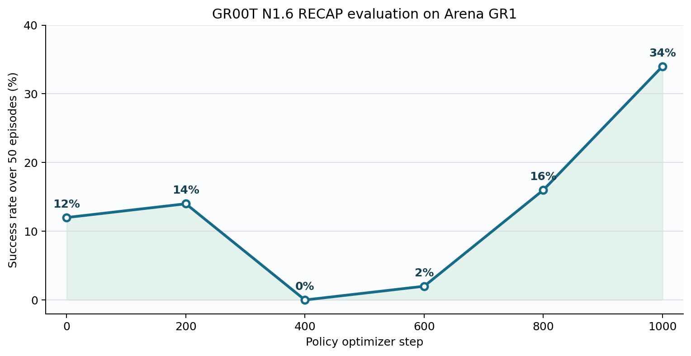
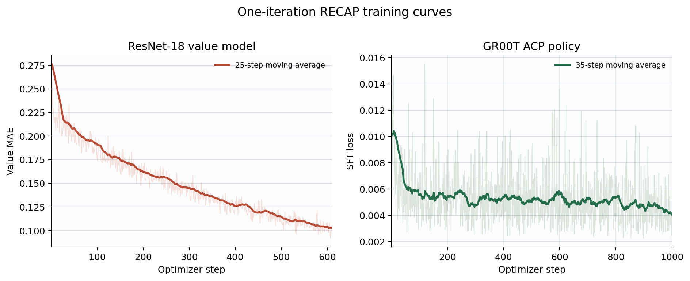

# GR00T N1.6 RECAP on Arena GR1

This guide reproduces one RECAP iteration for GR00T N1.6 on Isaac Lab Arena's
Fourier GR1 fridge task: place the sauce bottle on the top shelf and close the
fridge door. It starts from the native `checkpoint-10000` policy, collects 32
autonomous trajectories, trains a ResNet-18 value model, labels the rollout
data, and reports policy checkpoints from optimizer step 0 through step 1,000.

The starting policy succeeds on 6 of 50 trajectories (12%). The step-1000
policy succeeds on 17 of 50 (34%), an absolute improvement of 22 percentage
points and 2.83 times the initial success rate.

```{figure} ../../../_static/images/gr00t-arena-gr1-success.gif
:alt: Synchronized head and wrist views of a successful GR00T rollout
:width: 480px
:align: left

A successful autonomous rollout from the reference run: head camera on the
left, right-wrist camera on the right.
```

## Install the environment

Build and enter the maintained Isaac Lab Arena image before running this
recipe. The Dockerfile pins Arena and its Isaac Lab and GR00T submodules, uses
Isaac Sim's CUDA and Python runtime, and installs verl-vla in editable mode.

```bash
docker build \
  -f docker/Dockerfile.isaaclab_arena \
  -t isaaclab_arena:gr00t-runtime \
  .
```

Unless stated otherwise, run every command below inside a container built from
this image. For the two-machine setup, run each Ray command inside the
container on the corresponding machine.

The reference Ray cluster exposes eight H20 GPUs with the custom resource
label `train_rollout` and four RTX 4090 GPUs with the label `sim`. Policy
rollout and training use the H20 nodes; the 4090 nodes host the Arena
simulators. The value model and value inference use two of the H20 GPUs.

### Start Ray on two machines

Run the same container image on both machines with host networking, and make
sure the worker can reach the head node's Ray ports. In the reference cluster,
the eight-H20 machine at `192.168.16.84` is the Ray head. Start it first:

```bash
ray stop --force
ray start --head \
  --dashboard-host=0.0.0.0 \
  --resources='{"train_rollout": 1}'
```

Then join the four-RTX-4090 simulator machine to that head:

```bash
ray stop --force
ray start \
  --address='192.168.16.84:6379' \
  --resources='{"sim": 1}'
```

Replace `192.168.16.84` with the reachable address of the H20 machine when
using another cluster. From either machine, confirm that both nodes and the
`train_rollout` and `sim` resources are visible:

```bash
ray status --address='192.168.16.84:6379'
```

Download the GR1 fridge checkpoint from
[`china-sae-robotics/gr00t_n16_gr1_sequential_task`](https://huggingface.co/china-sae-robotics/gr00t_n16_gr1_sequential_task/tree/main/checkpoint-10000).
Run this command from the verl-vla repository root:

```bash
mkdir -p .data/models
hf download china-sae-robotics/gr00t_n16_gr1_sequential_task \
  --include "checkpoint-10000/*" \
  --local-dir .data/models
```

The include pattern preserves the `checkpoint-10000/` directory, producing
the launcher's default path `.data/models/checkpoint-10000`. A complete native
checkpoint contains `config.json`, `processor_config.json`,
`model.safetensors.index.json`, and the model weight shards. Set
`RECAP_INITIAL_POLICY_PATH` when storing it elsewhere.

The launcher forwards any existing `http_proxy`, `https_proxy`, `HTTP_PROXY`,
and `HTTPS_PROXY` variables into Ray's runtime environment. It does not store
cluster-specific proxy credentials in the recipe.

## Start training

Run the maintained launcher from the repository root:

```bash
bash examples/rl/recap/gr00t/arena_gr1_from_checkpoint_10000/run_train.sh
```

Run the launcher in the H20 head container. It uses Ray address `auto` and
attaches to the cluster started above.

The launcher selects
`examples/rl/recap/gr00t/arena_gr1_from_checkpoint_10000/arena_gr1.yaml`, which
composes the shared six-stage RECAP workflow. The YAML owns the task, stage
order, dataset relationships, label settings, model adapters, and training
schedules. The launcher supplies only machine topology, batch sizes, Ray
runtime variables, and model/output locations. Append Hydra overrides to
adapt a run without editing the recipe. For example:

```bash
bash examples/rl/recap/gr00t/arena_gr1_from_checkpoint_10000/run_train.sh \
  recap.policy_eval.cluster.env.env_worker.num_envs=4
```

One iteration runs these stages in order:

1. Evaluate the unconditioned starting policy for 50 episodes.
2. Collect 32 autonomous Arena trajectories without human intervention.
3. Normalize trajectory returns to `[-1, 0]`.
4. Train the ResNet-18 value model for 10 epochs.
5. Infer values and label the top 30% of future-smoothed advantages positive.
6. Fine-tune GR00T with advantage-conditioned prompting and save every 200 steps.

The six-stage workflow evaluates the starting policy in stage 1 and evaluates
the policy produced by stage 6 after training. Intermediate checkpoints are
saved every 200 steps, but checkpoint sweeps are intentionally left to users
who need more detailed model selection.

## Outputs and monitoring

All artifacts are derived from one output root:

```text
outputs/rl/recap/gr00t/arena-gr1-from-checkpoint-10000/
├── arena_asset_cache/
├── checkpoints/
│   ├── policy/
│   └── value_model/
├── datasets/
│   └── local/
│       └── gr00t_arena_gr1_recap/
├── eval_results/
└── tensorboard/
```

Start TensorBoard in the container:

```bash
/isaac-sim/python.sh -m tensorboard \
  --logdir outputs/rl/recap/gr00t/arena-gr1-from-checkpoint-10000/tensorboard \
  --bind_all \
  --port 6008
```

Evaluation JSON files under `eval_results/` are the authoritative
policy-selection evidence. The reference checkpoint success rates are
non-monotonic, so training loss alone is not a suitable selection metric.

## Reference configuration

| Setting | Value |
| --- | --- |
| Task | Arena GR1 `put_item_in_fridge_and_close_door` |
| Starting policy | Native GR00T N1.6 `checkpoint-10000` |
| RECAP iterations | 1 |
| Workflow evaluation | 50 trajectories before training and after stage 6 |
| Collection | 32 autonomous trajectories, 15,656 frames |
| Successful collection trajectories | 3 / 32 |
| Cameras | Head robot POV and right wrist, 512 x 512 RGB |
| Robot state / action width | 26 / 26 |
| Value model | ImageNet-pretrained ResNet-18, fully trainable |
| Value-model training | 10 epochs, 610 optimizer steps |
| Value-model GPUs | 2 |
| Value global / micro batch size | 256 / 32 |
| Advantage horizon / smoothing window | 50 / 50 frames |
| Advantage smoothing decay | `0.95` |
| Target positive ratio | 30% (4,697 / 15,656 frames) |
| Policy schedule | 17 dataset passes; report checkpoints through step 1,000 |
| Policy GPUs | 8 |
| Policy global / micro batch size | 256 / 16 |
| Action chunk | 16 steps |
| Policy learning rate | Constant `1e-4` |

The value model encodes the head and wrist images with ResNet-18 branches and
fuses their features with the 26-dimensional robot state. Its final logged
MAE is `0.1055`. Value inference ranks exponentially smoothed 50-step
advantages and writes `recap.value`, `recap.advantage`, and `recap.indicator`
back into the LeRobot dataset. GR00T then receives positive or negative
advantage tags through its adapter while retaining the native flow-matching
loss and Hugging Face checkpoint format.

## Evaluation results

Each row is an independent 50-episode Arena evaluation from the reference
experiment. Step 0 is the starting checkpoint evaluated without ACP; trained
checkpoints are evaluated with ACP. The intermediate evaluations were an
offline analysis of saved checkpoints and are not part of the maintained
six-stage launcher.

| Policy optimizer step | Successful trajectories | Success rate | Average return | Mean successful trajectory length |
| ---: | ---: | ---: | ---: | ---: |
| 0 | 6 / 50 | 12% | 23.51 | 370.67 |
| 200 | 7 / 50 | 14% | 21.22 | 400.57 |
| 400 | 0 / 50 | 0% | 10.54 | -- |
| 600 | 1 / 50 | 2% | 13.33 | 412.00 |
| 800 | 8 / 50 | 16% | 13.82 | 391.75 |
| 1000 | 17 / 50 | **34%** | 40.46 | 361.76 |



The step-400 regression and later recovery make the environment evaluation
cadence important. Step 1000 is the best checkpoint in the reported range.

## Training curves

The value panel contains all 610 value-model optimizer steps. The policy panel
contains only optimizer steps 1 through 1,000. The reference policy job was
resumed once at step 183; optimizer, model, and global-step state were restored,
so the two TensorBoard event files form one continuous 0-to-1,000 curve. Thick
lines are moving averages for readability; checkpoint selection uses raw
environment evaluations.



## Published dataset

The labeled 1,000-step experiment dataset is public:

| Artifact | Location |
| --- | --- |
| Labeled rollout dataset | [`Miical/gr00t-arena-recap-iter1-step1000`](https://huggingface.co/datasets/Miical/gr00t-arena-recap-iter1-step1000) |
| Interactive episode viewer | [Open in the LeRobot visualizer](https://huggingface.co/spaces/lerobot/visualize_dataset?path=Miical%2Fgr00t-arena-recap-iter1-step1000) |

It contains 32 episodes, 15,656 frames, two H.264 camera streams, and all four
`recap.*` fields. Re-publish a local reproduction with the repository script:

```bash
export HF_TOKEN=hf_...
/isaac-sim/python.sh scripts/upload_lerobot_dataset.py \
  --root outputs/rl/recap/gr00t/arena-gr1-from-checkpoint-10000/datasets/local/gr00t_arena_gr1_recap \
  --repo-id YOUR_ORG/gr00t-arena-recap-iter1-step1000 \
  --tags gr00t arena recap
```
